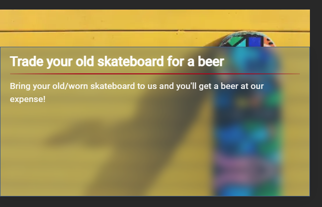

# Munch
Website for Munch street bar in Warsaw, currently not yet online.

# Table of contents
* [Technology Used](#technology-used)
* [Landing Page](#landing-page)
* [Admin Panel](#admin-panel)
* [Aditional Information](#aditional-information)
* [Contact](#contact)
* [License](#license)

# Technology Used
* React library + typescript
* React-Router -> routing
* React-Admin -> admin panel
* i18next + i18nexus -> translation
* Axios -> fetching data
* auth0 -> user authentication
* framer-motion -> animations
* Jest + React Testing Library -> testing

# Landing Page
## Home Page
Home page has a flag in upper right corner whichc allows for language change.

The following section invites user to see the menu of the restaurant. It has 2 rows of manu item images that scroll infinitely i oposing directions.

Another section displays 3 most recent events.

Footer contains basic contact information with social links and navigation.

## Menu Page
The example shows food subpage of menu page. Other subpages like beverages, drinks and alcohol look the same beside other menu items.

The items in menu are split into sections based on their type.

## Order Page
Currently ordering through website is disabled but will be available in the future

## People Page
People page consists of a button opening a dialog with instructions how to aply to work for this restaurant, an image of the crew and short description of the restaurant.

Job aplication dialog:

## Events Page
Events page has a 3 column grid of all events added by user.

Every event has a hover animation that results in displaying short description of given event.

### Event Page
Event page is a plece where you are redirected after clicking on chosen event. It contains all information about selected event.

## Contact Page
Contact pege consists of all contact information for a restaurant.

# Admin Panel
Admin panel is secured using auth0 authorization.
## Food Page
Every food page (food, beverages, drinks, alcohol) looks the same so only one will be presented as an example.

You can edit every item on the list using a form after clicking edit button. Adding new item has the same form so it will not be presented here.

Food has categories which represent the section the belong to when displayed on the site. Categories have a priority which determines their place on the page.

## Events Page
Events use rich text for their description allowing user to imput complex text with formatting.

Adding an event:

## Contact Page
Contact page consists of only one item that cannot be deleted.

Editing contact informations:

Editing also allows to input social media links which are not displayed in the list element because thy take up too much space and dont give much information.

## People Page
Editing the people infor allows to modify all the information displayed in the list so it will be omited here.

# Aditional Information
## Status
Project is: __in the final step of development__

## Contact
Created by [@Jan Szewczyński](https://github.com/lulek1410).
Feel free to contact me!

## License
This repository is not intended for further distribution and comercial use.

